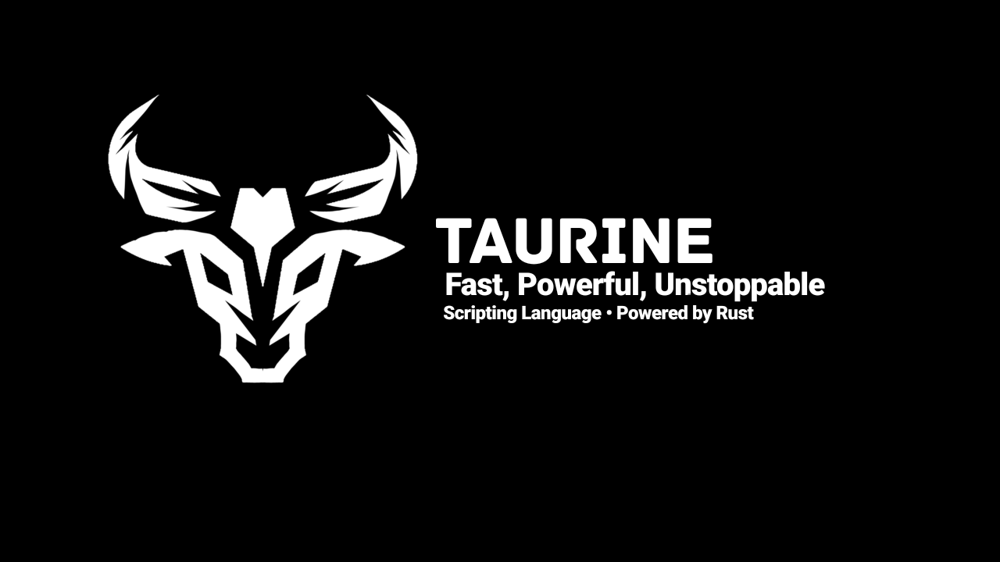

# Taurine

**Fast, embeddable scripting language implemented in Rust**

[](https://crates.io/crates/taurine)
[](LICENSE)
[](https://www.rust-lang.org)

[Crates.io](https://crates.io/crates/taurine) | [Examples](examples/)

Taurine combines the simplicity of Lua with the performance of compiled languages. It features a clean syntax, powerful built-in functions, and excellent Rust integration.

## Features

- **Fast execution** — Optimized interpreter with string interning and Rc/RefCell
- **Simple syntax** — Lua-like, easy to learn
- **Modern features** — f-strings, multi-return, destructuring, nil-safe operators (?.), escape sequences
- **Rich stdlib** — JSON, HTTP, crypto, date/time, regex (all built-in)
- **Safe navigation** — `?.` operator for null-safe property access
- **Advanced GC** — Multiple garbage collection strategies (Mark-and-Sweep, Generational, Arena, Reference Counting)
- **Embeddable** — Rust API, C API, Python/Node.js bindings

## Quick Start

### Install

```bash
# From crates.io
cargo install taurine

# Or build from source
git clone https://github.com/ffsonDev/taurine.git
cd taurine
cargo build --release
```

### Usage

```bash
# Run a script
taurine script.tau

# Start REPL
taurine --repl

# With optimizations
taurine --optimize script.tau

# Format code
taurine --format script.tau
```

### Hello World

```taurine
print("Hello, Taurine!")

let x = 10
let y = 20
print(f"x + y = {x + y}")
```

## Examples

### Variables and Functions

```taurine
// Variables
let name = "Taurine"
let version = "2.12.0"

// Functions with multi-return
function divmod(a, b) {
    return a / b, a % b
}

let (q, r) = divmod(10, 3)
print(f"Quotient: {q}, Remainder: {r}")
```

### Arrays and Loops

```taurine
// Arrays
let arr = [1, 2, 3, 4, 5]
print(f"Array: {arr}")
print(f"Length: {io_arraylen(arr)}")

// Loops with range
for i in 1..10 {
    if i == 5 { break }
    print(f"i = {i}")
}
```

### Tables and Safe Navigation

```taurine
// Tables (dictionaries)
let obj = { name: "Taurine", version: "2.12.0" }
print(obj?.name)  // nil-safe access
print(obj?.missing)  // Returns nil instead of error
```

### Lambdas and Closures

```taurine
// Lambda functions
let double = |x| x * 2
print(f"double(7) = {double(7)}")

// Closures
let add = |a, b| a + b
print(f"add(3, 4) = {add(3, 4)}")
```

### Recursive Functions

```taurine
// Recursion with proper return handling
function factorial(n) {
    if n <= 1 { return 1 }
    return n * factorial(n - 1)
}

print(f"factorial(5) = {factorial(5)}")  // Output: 120
```

### String Operations

```taurine
// Escape sequences
print("Line 1\nLine 2")  // Newline
print("Tab:\tHere")      // Tab

// String methods
let text = "Hello, Taurine!"
print(io_upper(text))    // HELLO, TAURINE!
print(io_lower(text))    // hello, taurine!
```

### JSON

```taurine
// JSON parsing and stringification
let data = { name: "Test", value: 42 }
let json_str = json_stringify(data)
print(f"JSON: {json_str}")

let parsed = json_parse(json_str)
print(f"Name: {parsed?.name}")
```

## Standard Library

Taurine includes a rich standard library built-in:
Math, String, Arrays, Tables, JSON, HTTP, Cryptography, Regular Expressions and more..

All stdlib functions are available without imports.

## Embedding

### Rust

```rust
use taurine::Interpreter;

fn main() -> Result<(), String> {
    let mut interp = Interpreter::new();
    interp.run(r#"print("Hello from Rust!")"#)?;
    Ok(())
}
```

### C

```c
#include "taurine.h"

int main() {
    TaurineVM* vm = taurine_new();
    taurine_run(vm, "print(\"Hello from C!\")");
    taurine_free(vm);
    return 0;
}
```

See `examples/embedding/` for more examples.

## Performance

Taurine uses several optimization techniques:

- **String interning** — All identifiers stored as IDs, O(1) comparison
- **Constant folding** — Compile-time evaluation of constant expressions
- **Dead code elimination** — Removes unreachable code
- **Optimized GC** — Multiple collection strategies for different workloads

## Safety

Taurine includes a built-in safety system:

```taurine
// Sandbox with permissions
// Control access to: filesystem, network, environment, processes
```
## License

This project is licensed under the [MIT License](LICENSE).

## Acknowledgments

Taurine is inspired by:
- **Lua** — Simple and embeddable
- **Rust** — Safety and performance
- **JavaScript** — Modern syntax features